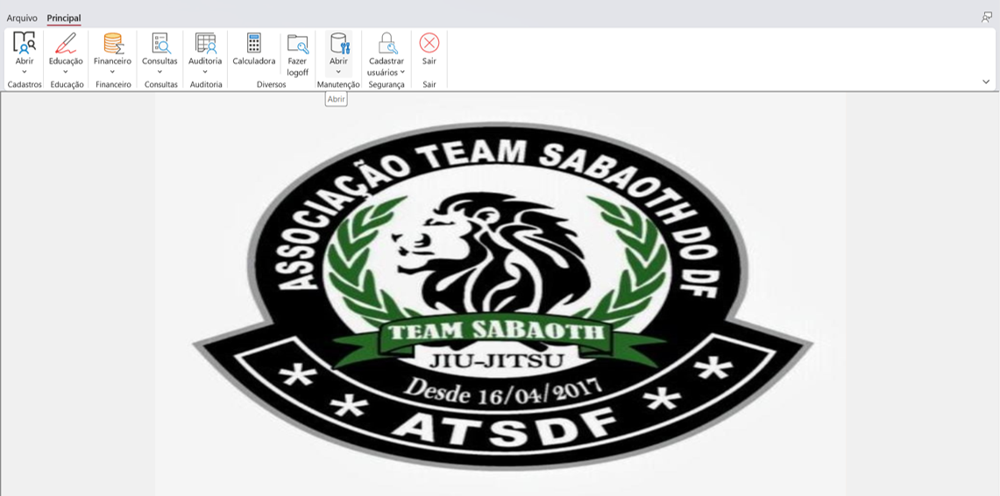
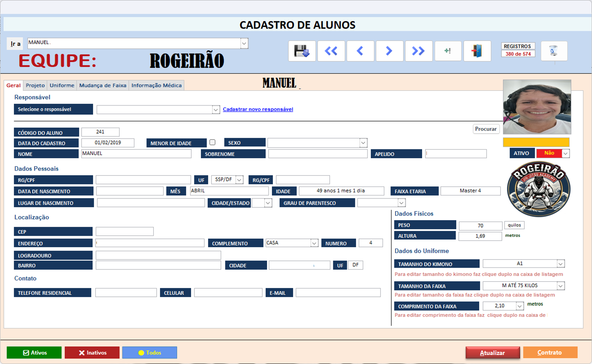
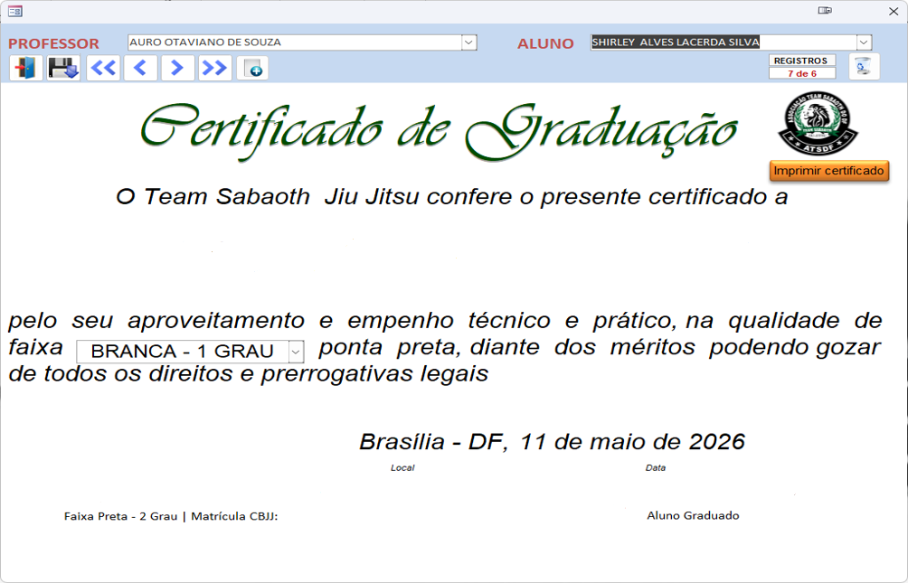
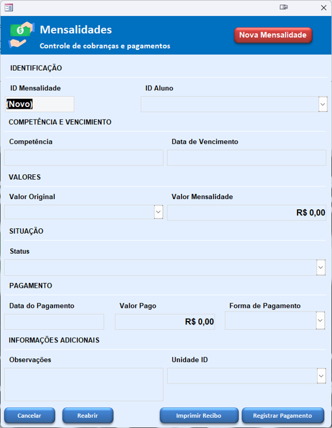

 # 🥋 Sistema de Controle de Academia de Jiu-Jitsu

Projeto robusto desenvolvido em **Microsoft Access** com foco na automação administrativa, controle de alunos e gestão financeira para academias de artes marciais.

## 🎯 Objetivo
Substituir controles manuais por uma solução digital integrada, facilitando a tomada de decisão e a organização operacional do Dojô.

## 🚀 Funcionalidades Principais
- **Gestão de Alunos:** Cadastro completo com histórico de graduações.
- **Financeiro:** Controle de mensalidades, registro de pagamentos e emissão de recibos.
- **Progressão de Faixas:** Monitoramento de tempo de treino e datas de graduação.
- **Presença:** Registro automatizado para controle de frequência.
- **Documentação:** Geração automática de contratos e certificados de graduação em PDF.

## 🛠 Tecnologias e Recursos
- **Backend:** Banco de dados relacional em Access.
- **Lógica de Programação:** VBA (Visual Basic for Applications) para automação de formulários.
- **Linguagem de Consulta:** SQL para relatórios e filtros dinâmicos.
- **Integração:** Exportação de dados e relatórios para Excel.

---

## 📸 Demonstração (Capturas de Tela)

### 🖥️ Dashboard Principal
*Visão geral do sistema com acesso rápido aos módulos.*

### 👥 Gestão de Alunos
*Interface intuitiva para cadastro e consulta de membros.*

### 🎓 Graduação e Certificados
*Processo de emissão de certificados após a troca de faixa.*

*Resultado final: Certificado gerado automaticamente pelo sistema.*

### 💰 Controle Financeiro
*Gestão de mensalidades e geração de recibos profissionais.*

---

## 👨‍💻 Desenvolvedor
**Manuel Jesus M. Franco Feliu** *Estudante de Análise e Desenvolvimento de Sistemas (ADS)*

---
> **Nota:** Este projeto demonstra habilidades em modelagem de dados, automação de processos de negócio e desenvolvimento de interfaces de usuário (UI) em ambiente desktop.
